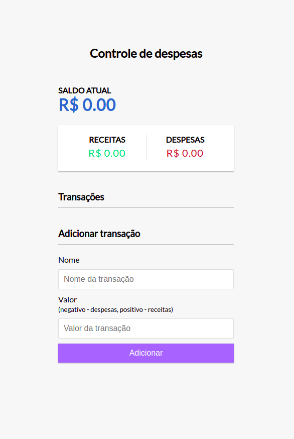
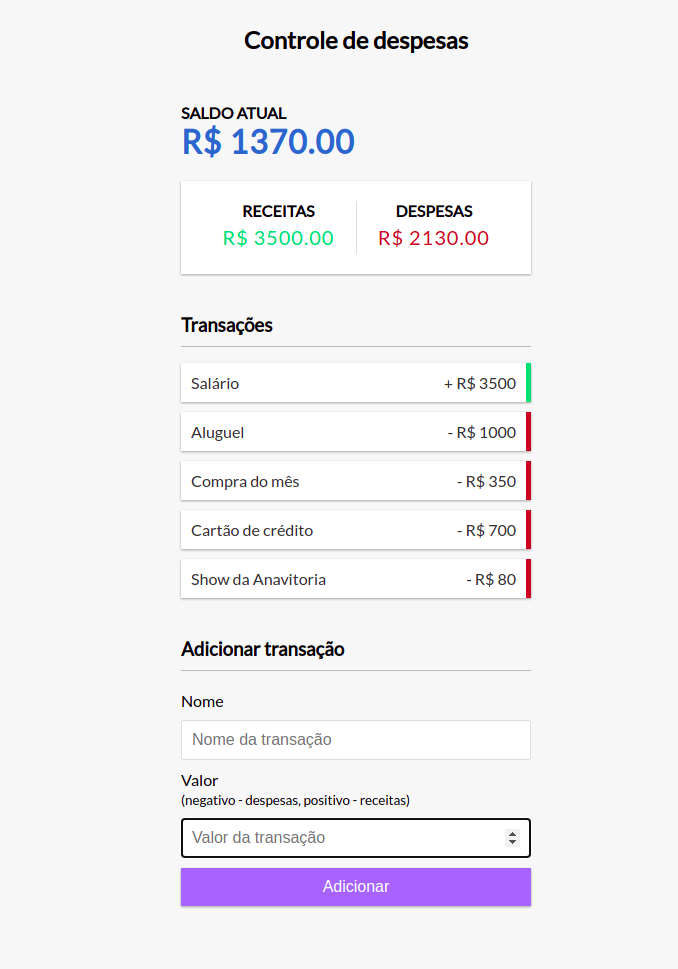

<h2 align="center">Controle financeiro</h2>

🚩 Sistema com objetivo de gerenciar a entrada e saída do dinheiro dos usuários. 

<h4  id="status" align="center"> Status do projeto
	 🚀 Finalizado 
</h4>

<h2 align="center"> Features </h2>

- [x] Adicionar receita
- [x] Adicionar despesas
- [x] Visualizar saldo total
- [x] Remover transações da lista

<h2 align="center" > Screenshots da aplicação </h2>

<h2 align="center" id="tecnologias"> 🛠 Tecnologias </h2>

:heavy_check_mark: HTML5  
:heavy_check_mark: CSS3  
:heavy_check_mark: Javascript

<h2 align="center" id="autor"> Autora </h2>

Feito com ❤️ por Keylane Silva 👋🏽 Entre em contato! 

